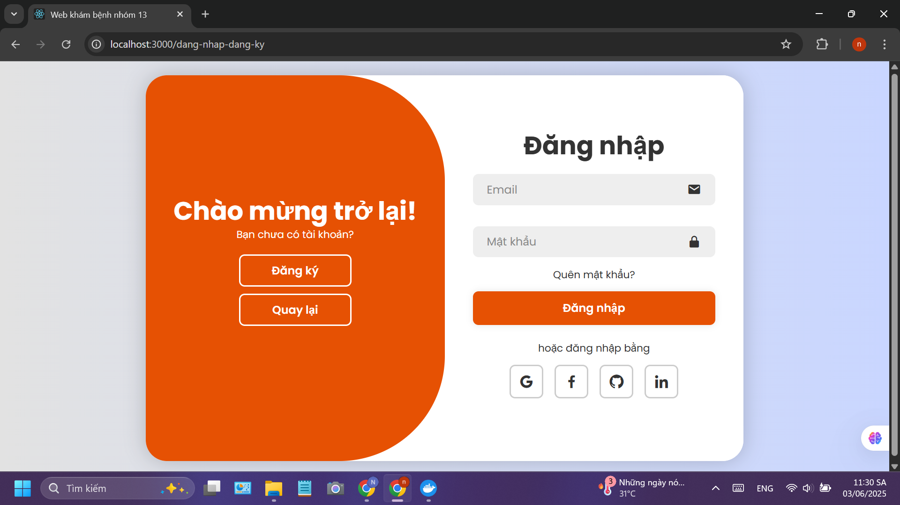
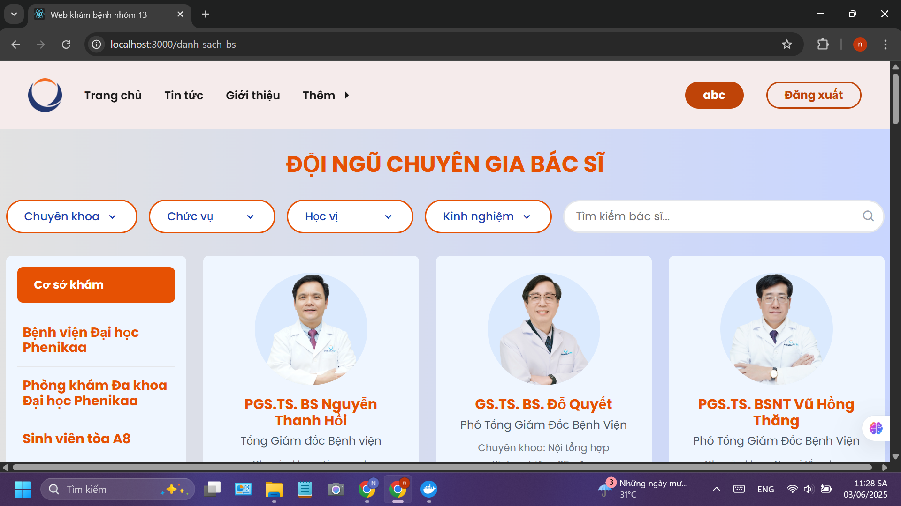
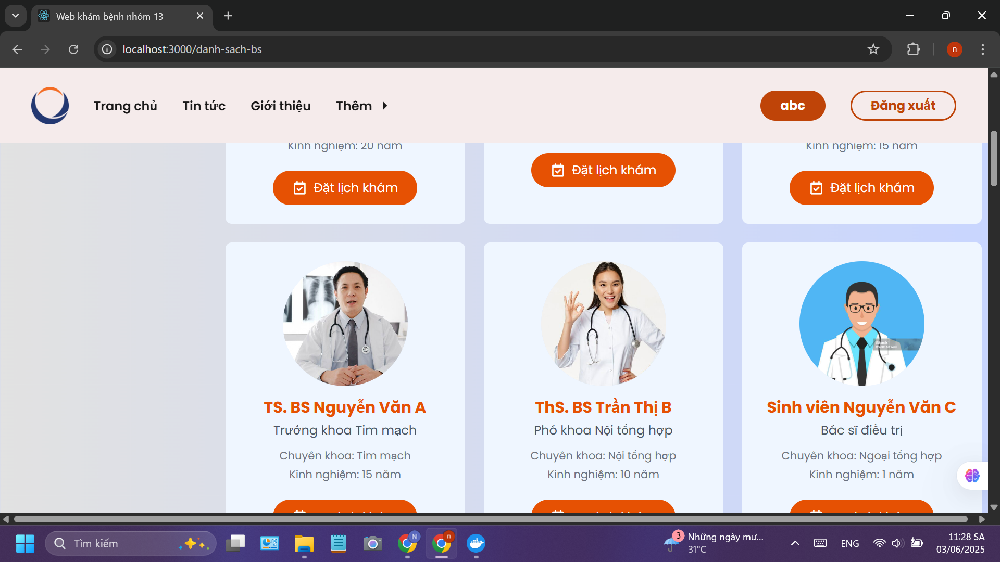
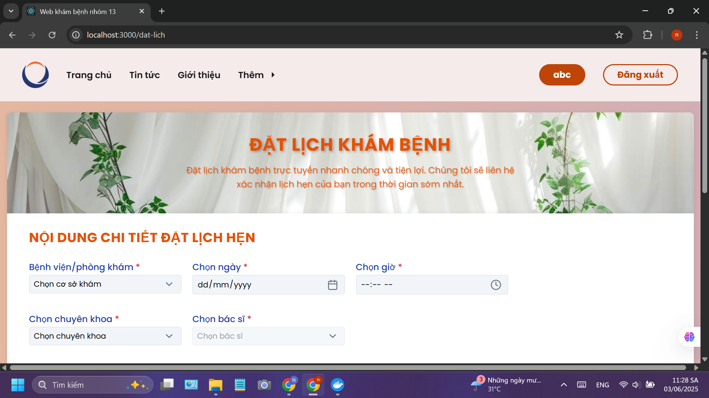
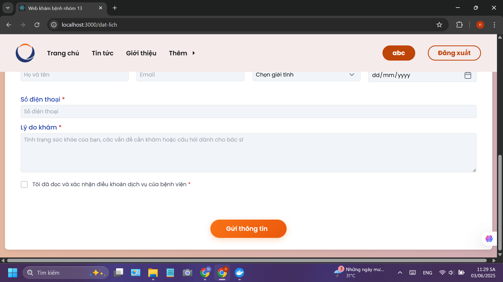
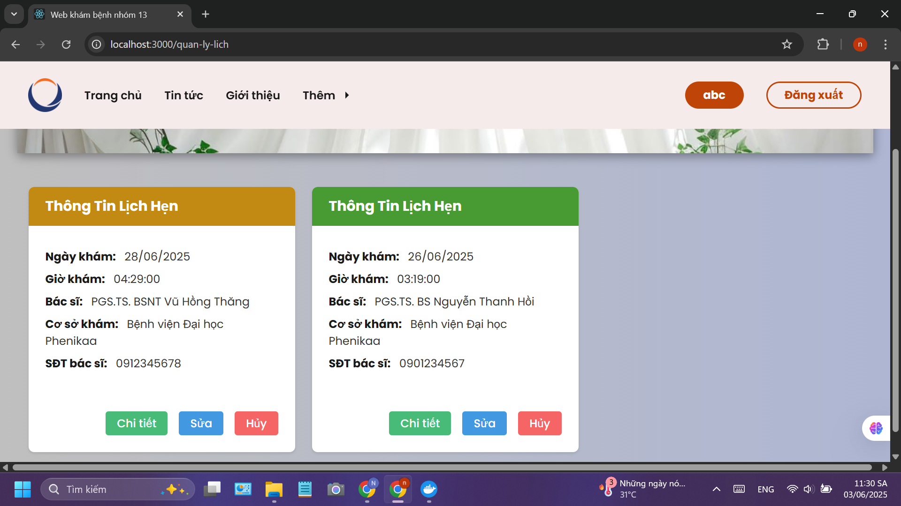

# Hệ thống Đặt lịch Khám bệnh Trực tuyến

## Giới thiệu
Hệ thống Đặt lịch Khám bệnh Trực tuyến là một nền tảng web cho phép bệnh nhân đặt lịch khám bệnh trực tuyến với các bác sĩ tại Bệnh viện Đại học Phenikaa và Phòng khám Đa khoa Đại học Phenikaa. Hệ thống được xây dựng theo kiến trúc microservices, sử dụng các công nghệ hiện đại để đảm bảo tính ổn định và khả năng mở rộng.

## Điểm đặc biệt
Điểm đặc biệt nổi bật của dự án là việc phân tán các chức năng thành ba microservice riêng biệt: AuthService (port 3001) chuyên xử lý xác thực người dùng và bảo mật, DsBsService (port 3002) quản lý thông tin bác sĩ và tìm kiếm, DatLichService (port 3003) xử lý quy trình đặt lịch và quản lý lịch hẹn. Tất cả các service được kết nối thông qua Kong API Gateway (port 8000), tạo nên một hệ thống thống nhất và an toàn. Việc phân tán này không chỉ giúp dễ dàng bảo trì và mở rộng từng phần mà còn cho phép sử dụng công nghệ phù hợp cho từng service, đồng thời tăng tính sẵn sàng của toàn bộ hệ thống.

## Các chức năng chính

### 1. Xác thực người dùng
- Đăng ký tài khoản mới
- Đăng nhập vào hệ thống
- Quản lý thông tin cá nhân
- Bảo mật thông tin người dùng

### 2. Tìm kiếm và lọc bác sĩ
- Tìm kiếm bác sĩ theo tên
- Lọc bác sĩ theo:
  + Chuyên khoa (Tim mạch, Nội tổng hợp, Ngoại tổng hợp, Khoa sản, Khoa Dược)
  + Học vị (Tiến sĩ, Thạc sĩ, Bác sĩ chuyên khoa, Bác sĩ nội trú)
  + Kinh nghiệm
  + Cơ sở khám bệnh
- Xem thông tin chi tiết về bác sĩ

### 3. Đặt lịch khám
- Chọn bác sĩ
- Chọn ngày và giờ khám
- Nhập thông tin bệnh nhân
- Mô tả lý do khám
- Xác nhận đặt lịch

### 4. Quản lý lịch khám
- Xem danh sách lịch hẹn
- Theo dõi trạng thái lịch hẹn
- Hủy lịch hẹn
- Xem lịch sử khám bệnh

## Công nghệ sử dụng
- **Frontend**: React.js
- **Backend**: Node.js/Express.js
- **Database**: PostgreSQL
- **Cache**: Redis
- **API Gateway**: Kong
- **Container**: Docker
- **Authentication**: JWT (JSON Web Token)

## Giao diện người dùng

### Trang chủ


### Trang đăng nhập


### Trang tìm kiếm bác sĩ



### Trang đặt lịch



### Trang quản lý lịch hẹn


## Cài đặt và chạy dự án

### Yêu cầu hệ thống
- Docker
- Docker Compose
- Node.js (version 14 trở lên)
- PostgreSQL
- Redis

### Các bước cài đặt
1. Clone repository:
```bash
git clone [https://github.com/QUOCNGOC2004/Project]
cd Project
```

2. Chạy dự án với Docker Compose:
```bash
docker-compose up -d
```

3. Truy cập ứng dụng:
- Frontend: http://localhost:3000
- Kong API Gateway: http://localhost:8000
- Kong Admin API: http://localhost:8001
